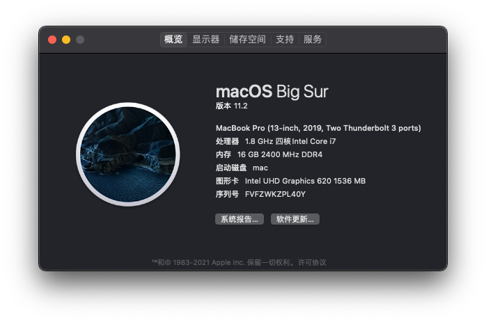
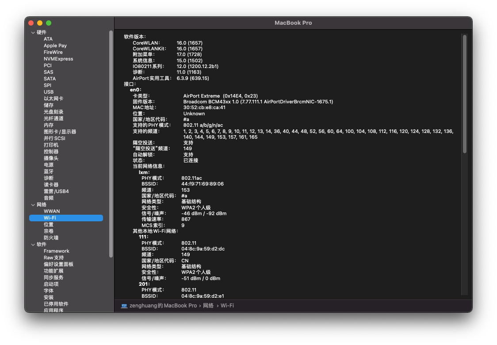
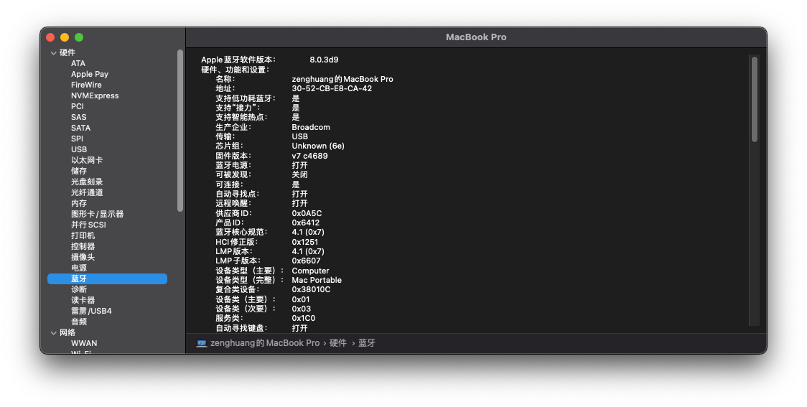
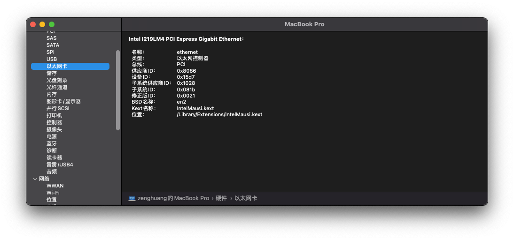
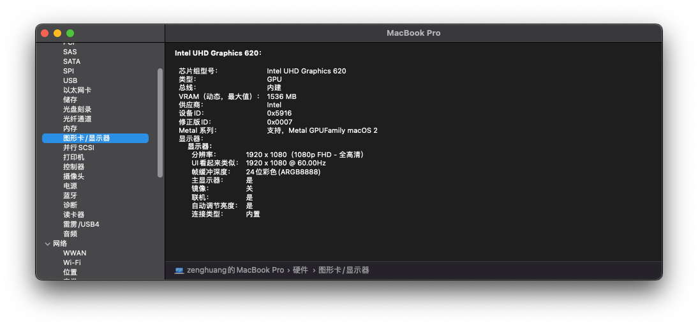
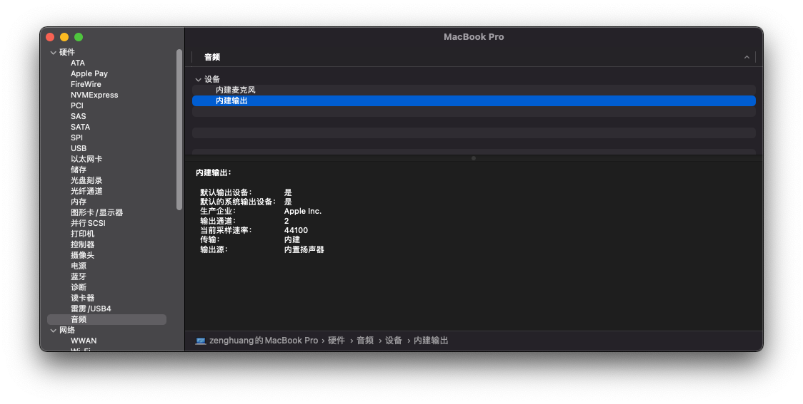
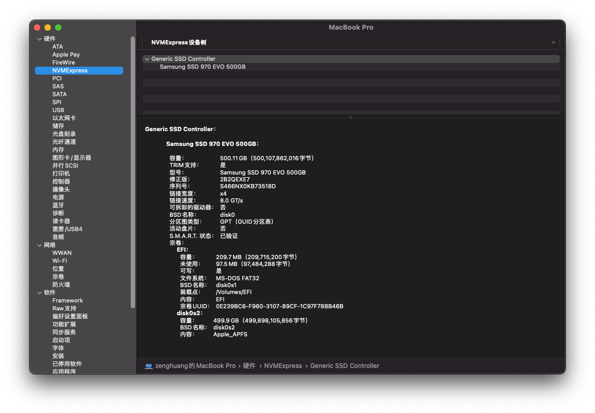

# Latitude-E7390-macOS

EFI for MacOS Big Sur, using OpenCore 0.6.5

## 配置：Dell Latitude 7390

- CPU: kaby-lake-R i5-8250u
- GPU：UHD620
- 分辨率：1920X1080
- 接口：type-C,HDMI,USBX2,TF读卡器,耳机孔,千兆网口(I219),无线网卡(DW1820A)
- 硬盘：Samsung 970evo nvme 500G

## 可用：
- GPU
- HDMI
- USB
- 声卡ALC256
- 耳机
- 网卡
- CPU变频
- type-C （可接type-C硬盘）
- 触摸板
- WIFI 蓝牙(DW1820A)
- 屏幕亮度

## TODO：
- keymap
- 触摸板下方左右按键

## 教程：

- ```git clone https://github.com/guozenghuang/latitude-E7390-hackintosh.git``` 或下载zip解压
- 下载 ```MacOS Big Sur``` 镜像，```opencore```，或可以直接使用小兵镜像
- 使用[etcher](https://www.balena.io/etcher/)将镜像写至U盘，并替换EFI文件为本仓库```OPENCORE/EFI```文件
- BIOS SETTING [link](https://blog.daliansky.net/macOS-BigSur-11.2-20D64-Release-version-with-OC-0.6.6-and-Clover-5129-and-PE-original-image.html#BIOS%E8%AE%BE%E7%BD%AE%E9%80%89%E9%A1%B9%E5%88%97%E8%A1%A8)
- U盘启动，在安装完成替换硬盘EFI前均使用U盘启动（中途可能需要手动重新启动，除第一次opencore选择bigsur install外后面均选择安装的硬盘）
- 使用```diskutil list``` , ```sudo diskutil mount disk0s1```挂载EFI分区
- 将U盘的EFI或本仓库的EFI拷贝至挂载的EFI，后即可脱离U盘启动macOS

## 图片：

















## 参考
- [Hackintosh-Dell-Latitude-7390-2-in-1-OpenCore-EFI](https://github.com/PurpleCrumpets/Hackintosh-Dell-Latitude-7390-2-in-1-OpenCore-EFI)
- [黑果小兵](https://blog.daliansky.net/macOS-BigSur-11.2-20D64-Release-version-with-OC-0.6.6-and-Clover-5129-and-PE-original-image.html)
